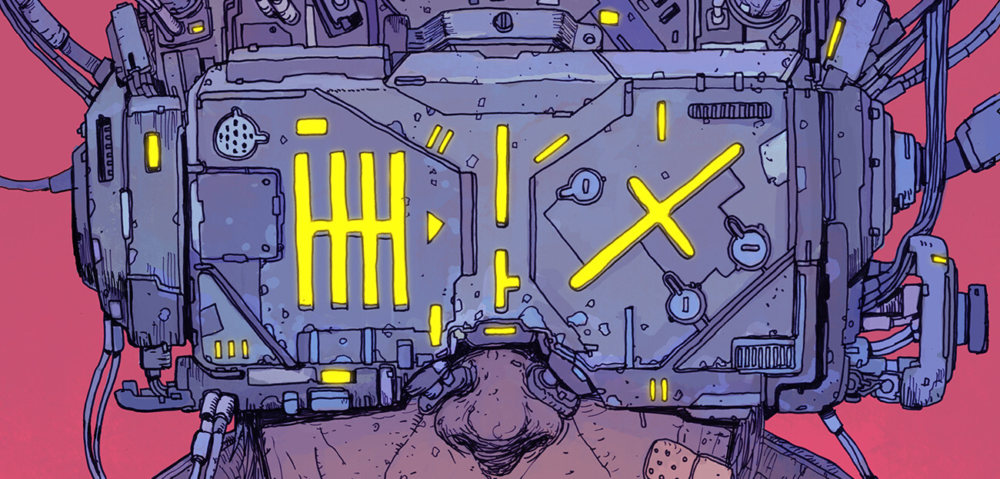

<h4 align="center">
  <!---->
  <hr>

  [](https://www.linkedin.com/in/lucas-ribeiro-php-developer/)

</h4>

<h3 align="center">
  <br>
  Ribeiro here!
  <br>
</h3>

```
  Description coming soon...
```

## > Technologies I'm working with
  Currently working with PHP, HTML, CSS and Javascript.
## > Some random facts about me
  Bulleted list coming soon...
